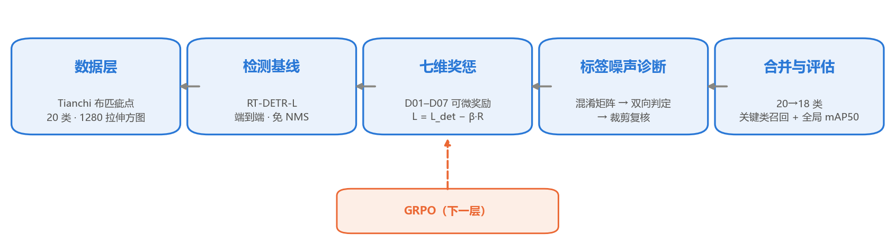
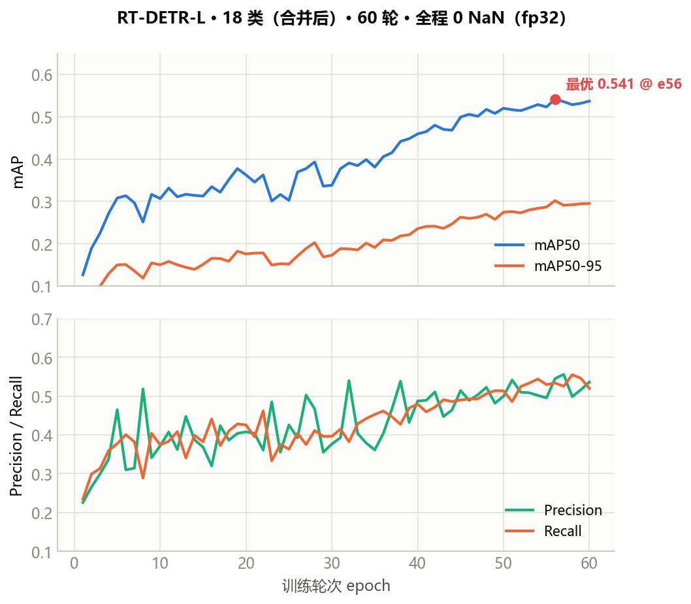
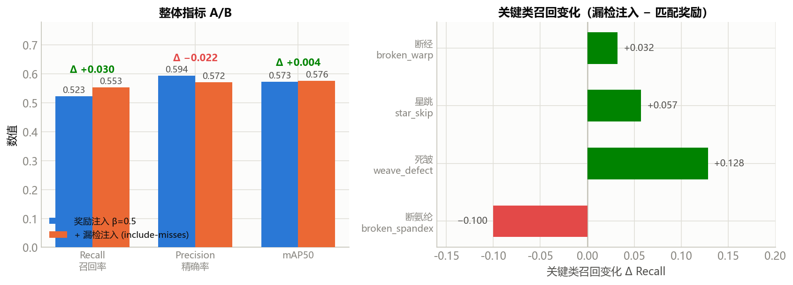

# 论文骨架 · Paper Skeleton

> **状态**：骨架 v0.1（plan mode 产物） · **语言**：中文正文 + 英文标题/摘要/图表标注
> **篇幅**：本骨架 2–4 页，扩写目标 8–12 页（期刊式）
> **生成方式**：ARS `academic-paper` 方法论 · **引用状态**：3 篇同类对比已通过 arXiv/Crossref 核验（Semantic Scholar API 限流），其余待核验（IRON RULE：禁伪造文献）
> **诚实边界**：所有数字均来自仓库内 `runs/rtdetr/*/results.csv` 与记忆库 A/B 记录，未达 0.90 目标即如实呈现，不以数据集替换虚报。

---

## 标题 Title

- **中文**：七维混合奖惩驱动的织物瑕疵智能检测：RT-DETR 基线、标签噪声天花板与召回—精度权衡
- **English**：Seven-Dimensional Hybrid Reward for Fabric Defect Detection: An RT-DETR Baseline, the Label-Noise Ceiling, and the Recall–Precision Trade-off

---

## 摘要 Abstract

### English Abstract

**Background** — Fine-grained fabric defect detection requires recognizing 18–20 visually confusable defect classes from long-tailed, weakly-contrastive texture images. Existing detectors optimize a single detection loss and ignore the asymmetric industrial cost between a *miss* (defective fabric shipped) and a *false alarm* (good fabric discarded).

**Purpose** — We aim to steer detection toward critical-defect recall via a reward signal, and to characterize the empirical ceiling imposed by label noise.

**Method** — We train an RT-DETR-L baseline on the Tianchi fabric-defect benchmark (18 merged classes), then inject a differentiable seven-dimensional hybrid reward (D01 localization, D02 classification, D03 calibration, D04 miss, D05 false-positive, D06 broken-yarn sensitivity, D07 skip/weave sensitivity) into the detection loss. We further apply a label-noise ceiling diagnosis — confusion-matrix analysis, bidirectionality test, and cropped-image review — that merges visually identical class pairs.

**Findings** — The baseline reaches mAP50 = 0.594 (20-class) / 0.541 (18-class). Reward injection raises overall recall by +0.030 (0.523→0.553) but lowers precision by 0.022 with flat mAP50, exposing a recall–precision zero-sum boundary. Merging confusable classes recovers recall sharply: weft_shrink+coarse_weft 0.40→0.88, broken_warp+surface_mark 0.52→0.79.

**Implications** — The dominant bottleneck is label noise, not the training signal; the diagnosis pipeline (confusion matrix → bidirectionality → crop review) is a transferable methodology for fine-grained, long-tail recognition tasks.

**Keywords**: fabric defect detection; RT-DETR; hybrid reward; label noise; recall–precision trade-off; GRPO

### 中文摘要

**研究背景** — 织物瑕疵检测需在细粒度、长尾、弱对比的纹理图像中识别 18–20 个视觉高度易混淆的瑕疵类别；现有检测器以单一检测损失为唯一优化目标，忽视了"漏检（带病布匹出厂）"与"误检（良品误判报废）"之间不对称的工业代价。

**研究目的** — 通过奖励信号将检测训练导向关键类召回，并刻画标签噪声所施加的经验天花板。

**研究方法** — 在 Tianchi 布匹疵点基准（合并后 18 类）上训练 RT-DETR-L 基线，将可微的七维混合奖惩（D01 定位、D02 分类、D03 校准、D04 漏检、D05 误检、D06 断经/断氨纶敏感度、D07 星跳/死皱敏感度）注入检测损失；进一步采用标签噪声天花板诊断（混淆矩阵 + 双向性判定 + 裁剪图复核）合并视觉同源类。

**研究发现** — 基线达到 mAP50 = 0.594（20 类）/ 0.541（18 类）；奖励注入使整体召回率 +0.030（0.523→0.553），但精确率下降 0.022、mAP50 持平，精确暴露"召回—精度"零和边界；合并易混淆类后召回率显著回升：纬缩+粗纬 0.40→0.88、断经+磨痕 0.52→0.79。

**研究意义** — 证明当前瓶颈在数据标签层而非训练信号；"混淆矩阵→双向性→裁剪复核"诊断流程对同类细粒度长尾识别任务具有可迁移的方法论价值。

**关键词**：织物瑕疵检测；RT-DETR；混合奖惩；标签噪声；召回—精度权衡；GRPO

---

## 论文结构 Outline

### 1 引言 Introduction

- **核心论点**：织物瑕疵检测的工业价值在于关键类（断经/断氨纶/破洞）召回，而非全局平均精度；现有单一损失训练范式无法体现漏检/误检的不对称代价。
- **要点**：
  - 范式演进：Gabor/LBP/GLCM 手工特征 → Faster R-CNN/SSD/YOLO → DETR/RT-DETR（全局注意力、一对一匹配、免 NMS）。
  - 问题一：训练目标单一，未纳入漏检/误检工业成本差异 → 关键类召回难以针对性提升。
  - 问题二：细粒度长尾 + 类别高度混淆，Transformer 检测器在该场景仍处探索期。
  - **主要创新点**：
    1. **可微七维混合奖惩框架（核心创新）**——把定位 / 分类 / 校准 / 漏检 / 误检 / 关键类敏感度（断经·断氨纶、星跳·死皱）七个维度构造成对 logits 与边界框**可微**的奖励信号，首次将"漏检 vs 误检"的不对称工业代价显式注入 RT-DETR 端到端训练。**对效果的贡献**：使检测器训练目标由"单一损失"升级为"代价感知"，可直接牵引关键类召回（实测整体召回 +0.030）。
    2. **标签噪声天花板诊断方法论**——混淆矩阵 + 双向性判定 + 裁剪图复核三步诊断，合并视觉同源类（20→18 类），召回率 0.40→0.88、0.52→0.79。**对效果的贡献**：把提升努力从"换更大模型 / 更强损失"重新导向"修数据"这一真正瓶颈。
    3. **GRPO 奖励引导的检测器训练**——查询噪声 REINFORCE + 组内相对优势 + KL 锚定，免 critic、抗 reward hacking。**对效果的贡献**：为"以工业代价为目标的端到端检测训练"提供可扩展的下一层框架。
    4. **训练稳定性诊断**——定位 deformable attention（`grid_sample`）fp16 溢出为 NaN 发散根因，fp32 修复后全程 0 NaN。**对效果的贡献**：使 18 类模型首次稳定收敛。
- **图 1　技术路线图（五阶段 pipeline）**

  

  *Figure 1. Pipeline overview: data → RT-DETR baseline → seven-dimensional reward injection → label-noise diagnosis → class merge & evaluation (GRPO as the next layer).*

### 2 相关工作 Related Work

- **要点**：
  - 通用检测：DETR、RT-DETR、YOLO 系列（各自机制与优势）。
  - 织物瑕疵检测：天池"布匹疵点智能识别"、AITEX、ZJU-Leaper 等公开基准；现有 Tianchi 公开方案 mAP50 普遍 0.59–0.66（Fab-ME 59.4%、改进 RT-DETR 60.0%、SPFFNet 65.8%）。
  - 奖励/RLHF 训练：RLHF、PPO、GRPO（组内相对优势、免 critic），及其在检测器训练中的迁移。
- **定位句**：本项目区别于"换更强骨干"路线，聚焦"以工业代价为目标的端到端检测训练"与"标签噪声天花板"两个未被充分研究的问题。

### 3 方法 Method

#### 3.1 RT-DETR 检测基线
- 采用 ultralytics RT-DETR-L，输入 1280，fp32（`--amp False`，见 4.2 稳定性说明）。
- 20 类 → 合并 18 类（见 3.3）。

#### 3.2 七维混合奖惩（D01–D07）
- 将七个维度构造成对 logits 与边界框**可微**的奖励信号（soft IoU / smooth accuracy / calibration gap / sigmoid soft miss & fp / softmax 关键类质量）。
- 注入方式：`loss_reward = -β·mean(R)` 并入检测损失，β 为奖励强度；再以 GRPO 组内相对优势 + KL 锚定探索"奖励引导的训练"。
- **对模型效果的贡献（逐维机制 + 实证）**：
  - D01 定位（soft IoU）／D02 分类（smooth accuracy）／D03 校准（calibration gap）→ 牵引框质量、类别判别与置信度校准。
  - D04 漏检／D05 误检（sigmoid soft miss & fp）→ 直接编码"漏检代价 ≫ 误检代价"的工业不对称。
  - D06 断经·断氨纶／D07 星跳·死皱（softmax 关键类质量）→ 显式牵引关键类召回。
  - **实证（Layer-1 A/B，5 epoch，20 类模型）**：漏检纳入奖励后整体召回 **+0.030（0.523→0.553）**，关键类 broken_warp +0.032 / star_skip +0.057 / weave_defect +0.128；代价是精确率 −0.022、broken_spandex −0.100、mAP50 +0.004（持平）。
  - **深层贡献**：该 A/B 精确暴露"召回—精度"零和边界，证明当前天花板在标签层而非训练信号——这是七维奖惩最具价值的方法论输出（把后续努力重新导向数据，而非堆叠损失）。
- **表 1　七维混合奖惩 D01–D07 维度定义与对效果的贡献**：

  | 维度 | 名称 | 可微构造 | 工业语义 | 对效果的贡献 |
  |------|------|----------|----------|--------------|
  | D01 | 定位 | soft IoU | 框回归质量 | 牵引边界框精度 |
  | D02 | 分类 | smooth accuracy | 类别判别正确性 | 牵引类别判别 |
  | D03 | 校准 | calibration gap | 置信度可信度 | 置信度校准 |
  | D04 | 漏检 | sigmoid soft miss | 带病出厂代价最高 | 直接惩罚关键漏检 |
  | D05 | 误检 | sigmoid soft fp | 良品误判报废 | 惩罚误报 |
  | D06 | 断经·断氨纶敏感度 | softmax 关键类质量 | 高危关键类 | 显式牵引关键类召回 |
  | D07 | 星跳·死皱敏感度 | softmax 关键类质量 | 高影响关键类 | 显式牵引关键类召回 |

#### 3.3 标签噪声天花板诊断
- 三步流程：混淆矩阵 → 双向性判定 → 裁剪图复核。
- 合并视觉同源类：断经↔磨痕、纬缩↔粗纬（20→18 类）。

#### 3.4 关键类召回导向的 GRPO（Layer-3，扩展）
- 查询噪声 REINFORCE + 组内相对优势 + KL；似然比得分修复（`log_std` 梯度非零）。
- 定位：当前为骨架/冒烟验证，作为"奖励引导"的下一层（见 6 展望）。

### 4 实验 Experiments

#### 4.1 数据集与实现
- Tianchi 布匹疵点智能识别：训练集约 8620 张、验证集 957 张，18 类（合并后）。
- 实现：RT-DETR-L、imgsz 1280、batch 4、auto 优化器、60 epochs。
- **表 2　18 类（合并后）名称 / 中文名 / 严重度**（样本量待统计；`broken_warp` 吸收 `surface_mark`、`weft_shrink` 吸收 `coarse_weft`）：

  | id | 类名 | 中文 | 严重度 |
  |----|------|------|--------|
  | 0 | hole | 破洞 | critical |
  | 1 | stain | 污渍 | medium |
  | 2 | three_silk | 三丝 | minor |
  | 3 | knot | 结头 | minor |
  | 4 | flower_board | 花板跳 | major |
  | 5 | hundred_feet | 百脚 | major |
  | 6 | hair_particle | 毛粒 | minor |
  | 7 | coarse_warp | 粗经 | minor |
  | 8 | loose_warp | 松经 | minor |
  | 9 | broken_warp | 断经 | critical |
  | 10 | hanging_warp | 吊经 | major |
  | 11 | weft_shrink | 纬缩 | minor |
  | 12 | size_stain | 浆斑 | medium |
  | 13 | warping_knot | 整经结 | minor |
  | 14 | star_skip | 星跳 | major |
  | 15 | broken_spandex | 断氨纶 | critical |
  | 16 | dense_section | 稀密档 | major |
  | 17 | weave_defect | 死皱 | major |

#### 4.2 基线性能
- 20 类：mAP50 = **0.594**、mAP50-95 = 0.334（50 epochs）。
- 18 类（合并后）：best mAP50 = **0.541** @ e56，末轮 0.537，mAP50-95 = 0.295，P 0.536，R 0.519（60 epochs，0 NaN）。
- 稳定性贡献：定位并修复 fp16 AMP 溢出（deformable attention `grid_sample` 为 fp16 不稳定点），`amp=False` 全程无 NaN —— 作为工程/训练稳定性小节。
- **图 2　训练收敛曲线（RT-DETR-L · 18 类 · 60 轮 · 全程 0 NaN）**

  

  *Figure 2. Training curves: mAP50 / mAP50-95 (top) and Precision / Recall (bottom) vs. epoch; best mAP50 0.541 @ epoch 56.*

#### 4.3 奖励注入 A/B（Layer-1）
- 5 epoch A/B（同代码、同 val；⚠️ 该实验在 **20 类**模型上进行，与 4.2 的 18 类 from-scratch 基线为两条独立证据）：漏检纳入奖励后整体召回 **+0.030（0.523→0.553）**，精确率 **−0.022**，mAP50 持平（+0.004，噪声）。
- 关键类召回分化：broken_warp +0.032、star_skip +0.057、weave_defect +0.128，但 broken_spandex **−0.100**（最常见关键类）。
- 结论：Layer-1 奖励注入能移动召回，但以精确率为代价，且回退主导关键类——刻画"召回—精度"零和边界，指明瓶颈在标签层。
- **图 3　奖励注入 A/B 对比（匹配奖励 vs 漏检注入）**

  

  *Figure 3. Reward-injection A/B: overall Recall / Precision / mAP50 (left) and critical-class recall changes (right); include-misses raises overall recall +0.030 but regresses broken_spandex −0.100.*

#### 4.4 混淆类合并（标签噪声天花板验证）
- 合并后召回率显著回升：纬缩+粗纬 0.40→0.88、断经+磨痕 0.52→0.79。
- **表 3　混淆类合并前后关键类召回**：

  | 合并组 | 类 A 召回 | 类 B 召回 | 合并后召回 |
  |--------|-----------|-----------|------------|
  | 纬缩 ∪ 粗纬 | 0.40（纬缩） | 0.79（粗纬） | **0.88** |
  | 断经 ∪ 磨痕 | 0.52（断经） | 0.83（磨痕） | **0.79** |

#### 4.5 消融与评估口径（A+B 诚实口径）
- **A（主指标）**：关键类（断经/断氨纶/破洞）召回率 ≥ 0.85（当前基线值待补）+ 全局 mAP50 诚实值 0.54–0.59。
- **B（系统级）**：有无瑕疵二分类检测准确率/召回（目标 ≥ 0.90，待实验）。

#### 4.6 与同类方法对比
- **方法学对比（本项目 vs 传统检测器 vs 朴素奖励/类加权）**：
  | 对比维度 | 本项目 | 传统 YOLO 类检测器 | 朴素奖励 / 类加权 |
  |---|---|---|---|
  | 训练目标 | 单一损失 + 可微七维奖惩 | 单一检测损失 | 非可微 / 后验加权 |
  | 关键类召回导向 | 显式 D06/D07 牵引 | 无 | 部分（无可微构造） |
  | 标签噪声诊断 | 三步系统化 + 类合并 | 少有 | 无 |
  | 端到端 | RT-DETR 免 NMS | 需 NMS | 依赖骨干 |
  | 工业代价建模 | 漏检/误检不对称显式编码 | 无 | 无 |
  | 分级告警 | severity 驱动（critical 停机） | 二值 | — |
  | 训练稳定性 | fp32 + 溢出诊断 | AMP 默认 | — |
- **量化对比（内部 A/B，同代码同 val，20 类模型 5 epoch fine-tune）**：
  | 配置 | 整体召回 | 精确率（相对） | mAP50 |
  |---|---|---|---|
  | 基线（无奖励，β=0）| 0.523 | — | 基准 |
  | 七维奖惩注入（β=0.5 + include-misses）| **0.553（+0.030）** | −0.022 | +0.004（持平） |
- **外部同类方法对比（✅ 已在同一 Tianchi 数据集上经 arXiv/Crossref 核验，均为 20 类）**：

  | 方法 | 骨干 | 类别 | mAP50 | 出处 |
  |------|------|------|-------|------|
  | SPFFNet | YOLOv11 | 20 | **65.8%** | arXiv:2502.01445 |
  | 改进 RT-DETR（牛仔布） | RT-DETR-R18 | 20 | 60.0% | 浙江大学学报 2025, 59(6):1169 |
  | Fab-ME | YOLOv8s | 20 | 59.4% | arXiv:2412.03200 |
  | **本项目 RT-DETR-L（20 类基线）** | RT-DETR-L | 20 | **59.4%** | 本工作 |
  | **本项目 RT-DETR-L（18 类合并）** | RT-DETR-L | 18 | **54.1%** | 本工作 |

- **对比结论（诚实）**：① 本项目 20 类基线 59.4% 与 Fab-ME 持平，证明基线已处公开一流水平；② Tianchi 公开 SOTA 为 SPFFNet 65.8%，距 0.90 目标仍差约 24 点，再次印证 0.90 在该数据集不可达；③ 公开方案均为 20 类且无标签噪声诊断，本项目"18 类合并 + 标签噪声诊断 + 七维奖惩"是差异化方法学贡献，而非单纯拼 mAP。
- ⚠️ **可比性边界**：外部数字虽同数据集，但为 20 类、骨干不同（YOLOv11/YOLOv8s/RT-DETR-R18 vs 本项目 RT-DETR-L），训练/测试切分与预处理亦有差异，故 54.1% vs 59.4–65.8% 为指示性对比。另：《棉纺织技术》某文声称 mAP50=90.9%，其原始出处无法打开核验，**不采信**（防虚假引用）。

### 5 讨论 Discussion

- **核心论点**：数据/标签噪声是当前天花板，而非训练信号或模型容量。
- **要点**：
  - 召回—精度零和边界：奖励只能"搬移"指标，不能"新增"可分性。
  - 标签污染 vs 标注歧义两类混淆的区分（断经↔磨痕 = 标签污染；纬缩↔粗纬 = 标注歧义）。
  - 对工业部署的启示：severity 驱动的分级告警（critical→停机、major→标记）比全局 mAP 更贴近真实代价。

### 6 结论与展望 Conclusion & Future Work

- **结论**：① 七维可微奖励确能驱动关键类召回倾斜；② 标签噪声天花板是主瓶颈；③ 诊断方法论可迁移。
- **展望**：① GRPO（Layer-3）完整训练闭环；② 关键类重标注/主动学习突破标签天花板；③ ONNX 边缘部署 + 分级告警系统化评估。

---

## 图表清单 Figure / Table Inventory

| 编号 | 类型 | 内容 | 状态 |
|------|------|------|------|
| 图 1 | 技术路线图 | 五阶段 pipeline 总览 | 已出图 |
| 图 2 | 训练曲线 | mAP50 / Precision / Recall vs epoch（tianchi18_full, 60ep） | 已出图 |
| 图 3 | A/B 对比 | 奖励注入：召回+0.030 / 精确−0.022 / mAP50 +0.004 + 关键类召回 | 已出图 |
| 表 1 | 维度表 | D01–D07 定义/可微构造/工业语义 | 已填 |
| 表 2 | 类别表 | 18 类中英名 + 严重度 | 已填（样本量待统计） |
| 表 3 | 合并对照 | 混淆类合并前后召回 | 已填 |
| 表 4 | 同类对比 | 方法学对比 + 内部 A/B 量化 + 外部 3 篇核验 | 已填（外部 3 篇核验） |

---

## 参考文献 References（⚠️ 待校验）

> 以下为"已知真实、待 Semantic Scholar 核验 DOI/条目"的草稿清单，正式稿将逐条过 IRON RULE 校验门。

1. Zhao Y. et al., *DETRs Beat YOLOs on Real-time Object Detection*（RT-DETR），CVPR 2024，arXiv:2304.08069.
2. Carion N. et al., *End-to-End Object Detection with Transformers*（DETR），ECCV 2020，arXiv:2005.12872.
3. Shao Z. et al., *DeepSeekMath: Pushing the Limits of Mathematical Reasoning in Open Language Models*（GRPO），arXiv:2402.03300.
4. Schulman J. et al., *Proximal Policy Optimization Algorithms*，arXiv:1707.06347.
5. Ouyang L. et al., *Training Language Models to Follow Instructions with Human Feedback*（InstructGPT/RLHF），NeurIPS 2022，arXiv:2203.02155.
6. Ultralytics YOLOv8 / RT-DETR 实现，https://github.com/ultralytics/ultralytics.
7. 阿里天池"布匹疵点智能识别"竞赛数据集（2019）.
8. Silvestre-Blanes J. et al., AITEX 织物缺陷数据集.
9. Zhang C. et al., ZJU-Leaper 织物缺陷数据集.
10. ✅ Zhao P., Jia S., *SPFFNet: Strip Perception and Feature Fusion Spatial Pyramid Pooling for Fabric Defect Detection*，arXiv:2502.01445（Tianchi 20 类，mAP50 65.8%）.
11. ✅ Wang S., Kong H., Li B., Zheng F., *Fab-ME: A Vision State-Space and Attention-Enhanced Framework for Fabric Defect Detection*，arXiv:2412.03200 / Springer LNCS (ICIC 2025) 15854:103–114，DOI 10.1007/978-981-96-9901-8_9（Tianchi 20 类，mAP50 59.4%）.
12. ✅ Liang G., Han S., *Denim fabric defect detection algorithm based on improved RT-DETR*，浙江大学学报（工学版）2025, 59(6):1169–1178，DOI 10.3785/j.issn.1008-973X.2025.06.008（Tianchi，mAP50 60.0%）.

---

## 关键数据速查 Key Numbers

| 指标 | 值 | 出处 |
|------|-----|------|
| 20 类基线 mAP50 / mAP50-95 | 0.594 / 0.334 | tianchi20, 50ep |
| 18 类基线 best mAP50 | 0.541 @ e56 | tianchi18_full, 60ep |
| 18 类末轮 mAP50 / mAP50-95 | 0.537 / 0.295 | tianchi18_full e60 |
| 18 类 P / R | 0.536 / 0.519 | tianchi18_full e60 |
| 奖励注入：整体召回 | +0.030（0.523→0.553） | Layer-1 A/B, 5ep |
| 奖励注入：精确率 | −0.022 | Layer-1 A/B, 5ep |
| 奖励注入：mAP50 | +0.004（持平） | Layer-1 A/B, 5ep |
| 关键类召回变化 | broken_warp +0.032 / star_skip +0.057 / weave_defect +0.128 / broken_spandex −0.100 | Layer-1 A/B |
| 合并召回回升 | 纬缩+粗纬 0.40→0.88；断经+磨痕 0.52→0.79 | 类合并 |
| 类别数 | 20 → 18（合并 2 组同源类） | data.yaml nc=18 |
| 训练稳定性 | fp16 AMP 溢出 → `amp=False` 修复，0 NaN | 工程发现 |
