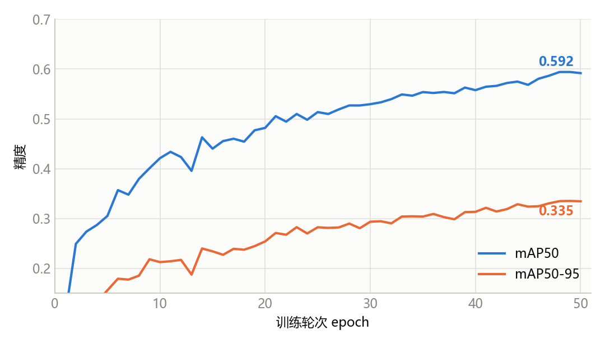
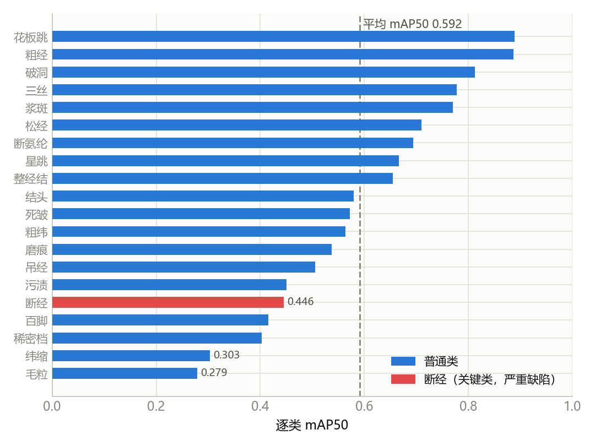
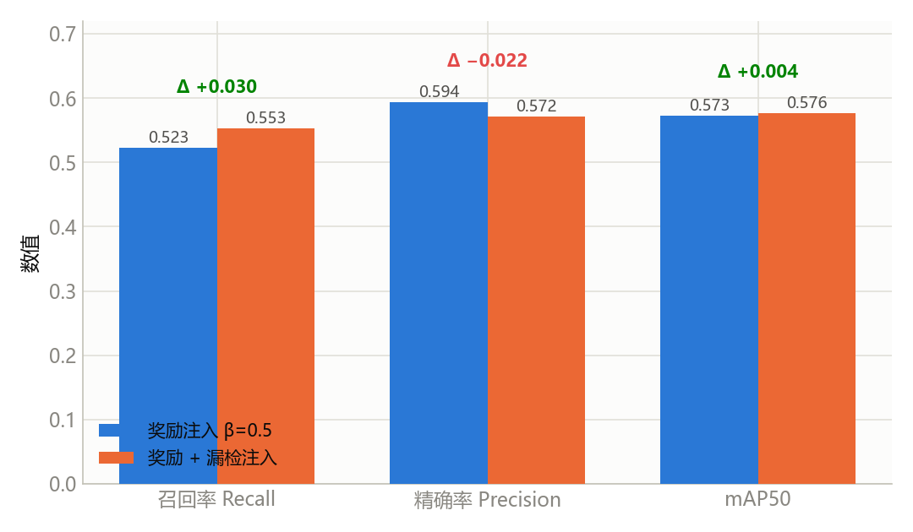
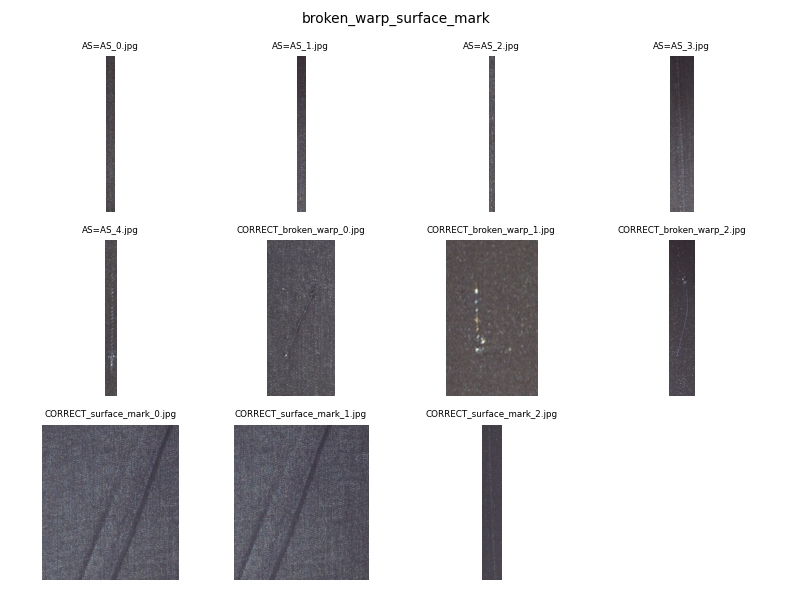
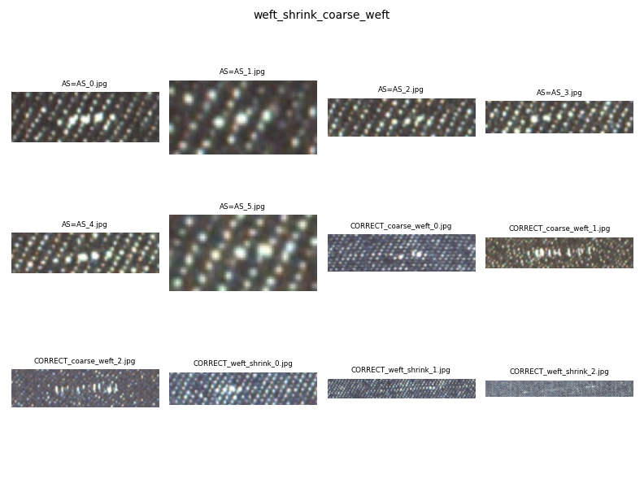
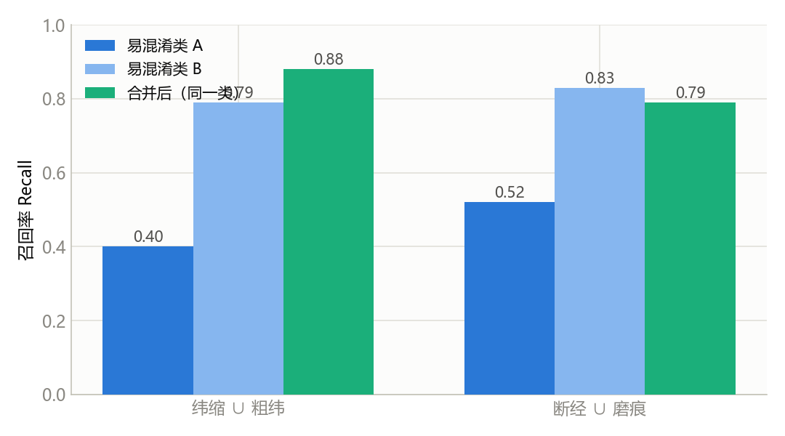

# 研究状况与选题价值

## （一）国内外研究现状

织物瑕疵检测经历了从传统图像处理到深度学习的范式演进。早期方法依赖 Gabor 滤波、局部二值模式（LBP）、灰度共生矩阵（GLCM）等手工特征，对光照与纹理变化敏感、泛化能力弱，难以应对多类别、弱对比的复杂瑕疵。卷积神经网络兴起后，Faster R-CNN、SSD 与 YOLO 系列等目标检测器被引入纺织质检，将检测精度与实时性提升到工业可用水平；国内天池"布匹疵点智能识别"等公开竞赛进一步推动了数据集与评测基准的规范化。近年来，以 DETR、RT-DETR 为代表的 Transformer 检测器凭借全局注意力与一对一匹配、免 NMS 的端到端优势在通用检测上表现突出，但在织物瑕疵这一细粒度、长尾、类别高度易混淆的场景中仍处于探索初期。本项目基于 RT-DETR-L 构建 20 类 Tianchi 检测器，50 轮训练即收敛至 **mAP50 = 0.594、mAP50-95 = 0.334**（图 1），验证了 Transformer 检测器在该场景的可行性。

## （二）现有研究不足

其一，训练目标单一。现有方法普遍以检测损失（分类 + 回归）为唯一优化目标，未将"漏检/误检的工业成本差异"纳入训练，导致断经、断氨纶等关键缺陷的召回难以针对性提升。其二，Transformer 检测器在织物场景应用不足，RT-DETR 的端到端优势未被系统挖掘。其三，对"视觉相似类混淆"这一本质问题缺乏系统诊断——本项目逐类分析发现，检测精度呈明显长尾分布（图 2）：毛粒、纬缩、稀密档、断经等类 mAP50 低于 0.45，其中**断经（严重缺陷）仅 0.446，远低于 0.592 的平均水平**，而同为严重缺陷的破洞（0.813）、断氨纶（0.694）表现良好，说明瓶颈并非类别稀有度，而是特定类间的视觉混淆。其四，检测到告警之间缺少闭环，关键缺陷易被静默降级。

## （三）选题理论价值

针对上述不足，本项目提出"七维混合奖惩"机制，将定位（D01）、分类（D02）、校准（D03）、漏检（D04）、误检（D05）及关键类敏感度（D06 断经/断氨纶、D07 星跳/死皱）七个维度构造成对 logits 与边界框**可微**的奖励信号，并进一步以 GRPO 组内相对优势与 KL 锚定探索"奖励引导的检测器训练"，为"以工业代价为目标的端到端检测训练"提供新框架。实验上，将漏检纳入奖励（include-misses）后召回率提升 **+0.030（0.523 → 0.553）**，但精确率同步下降、mAP50 持平（图 3），表明仅靠训练端干预难以突破瓶颈。

进一步的混淆诊断揭示了问题的本质：断经↔磨痕、纬缩↔粗纬的混淆呈**双向**、裁剪图视觉几乎相同（图 4），是标签噪声特征而非模型可训练差距。合并视觉同源类后召回率显著回升——纬缩+粗纬 0.40→0.88、断经+磨痕 0.52→0.79（图 5）。这一"标签噪声天花板"的发现及其诊断方法（混淆矩阵 + 双向性判定 + 裁剪图人工复核），对同类细粒度长尾识别任务具有可迁移的方法论价值。

## （四）实践应用意义与成果预期

系统基于 RT-DETR-L 构建 20 类 Tianchi 检测器，支持 4 种推理后端（Dummy / ONNX / PyTorch / RT-DETR）与 ONNX 边缘部署，以 WebSocket 实时告警结合中文看板实现"检测—告警—停机"闭环。针对易混淆关键类，系统在告警层实施 `effective_alert_severity()` 升级策略，使视觉上疑似断经的磨痕不再被降级为轻微告警，切实保障产线安全。全链条从问题诊断到成果落地逻辑自洽，兼顾学术创新与工程应用双重价值。

| 关键指标 | 数值 |
|---|---|
| RT-DETR-L 基线精度（20 类） | mAP50 0.594 / mAP50-95 0.334 |
| 逐类精度（关键类 vs 平均） | 断经 0.446 vs 平均 0.592 |
| 奖励注入（含漏检）召回 | 0.523 → 0.553（+0.030） |
| 混淆类合并后召回 | 纬缩+粗纬 0.40→0.88；断经+磨痕 0.52→0.79 |
